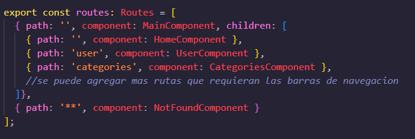

# Prueba Tecnica Milio

Este es un proyecto realizado para una prueba tecnica en Milio [https://milio.com.co/](https://milio.com.co/) para desarrollador frontend Angular

## Descripción General

Este proyecto es una paguina con el diseño de e-commerce desarrollada con `Angular 18`. Utiliza `Server-Side Rendering (SSR)` para mejorar el rendimiento y el SEO, y sigue una Arquitectura Hexagonal para mantener un código modular, fácilmente escalable y desacoplado. Además, el proyecto cumple con los principios `SOLID para` asegurar que el código sea mantenible, flexible y robusto.

## Arquitectura Hexagonal

La aplicación sigue una `Arquitectura Hexagonal`, también conocida como arquitectura de puertos y adaptadores. Esta arquitectura permite que el código esté organizado en capas separadas que interactúan a través de interfaces, facilitando la sustitución de componentes sin afectar el resto de la aplicación.

En esta estructura:

 -Capa de Dominio:Contiene las reglas de negocio principales de la aplicación. Este es el "corazón" de la aplicación, sin dependencias externas localizado en `app.component`

 -Capa de Aplicación: Contiene los casos de uso de la aplicación, orquestando la interacción entre el dominio y las interfaces estan en `main.component`

 -Adaptadores: Aquí se encuentran las implementaciones de los puertos que conectan el dominio con el mundo externo, como servicios de bases de datos, controladores de API y la interfaz de usuario (UI).

Esta arquitectura ayuda a que la aplicación sea más modular y testeable, facilitando la incorporación de cambios sin afectar la estructura central.

### Consumo de JSON Local

Para cargar la información de los productos, la aplicación utiliza un archivo `JSON local`. Este enfoque permite cargar datos de manera rápida y eficiente durante el desarrollo y las pruebas. El archivo productos.json contiene un arreglo de objetos, cada uno representando un producto con atributos como id, nombre,tallas, precio, imagen, y descripción.

Este JSON es consumido en el componente correspondiente a la lista de productos mediante un servicio que lee el archivo y lo transforma en un array de objetos que puede ser utilizado en la interfaz de usuario.

### Uso de Props para Categorías

Para manejar las categorías de productos, se utiliza un array que se pasa como props a los componentes correspondientes. Este array se define en el componente padre y se distribuye entre los componentes hijos, permitiendo que cada componente tenga acceso a la información necesaria sobre las categorías, el componente `Category-card` recibe un array de categorías como propiedad de entrada, lo que permite que el componente se mantenga modular y reutilizable.

### Llamada a API para Obtener un Usuario Aleatorio

Para mostrar una imagen de usuario en la vista de usuario, la aplicación realiza una llamada a una API externa [https://randomuser.me/api/](https://randomuser.me/api/) que devuelve un usuario aleatorio. Esto se realiza utilizando el servicio HttpClient de Angular, que permite hacer solicitudes HTTP de manera sencilla.

## Funcionamiento de las Rutas

La aplicación utiliza un sis-routestema de rutas de la siguiente manera:

Ruta Principal (MainComponent): La ruta base (path: '') carga el `MainComponent`, que es un contenedor que incluye las secciones principales de la aplicación. Este componente contiene la barra de navegación que es compartida en varias páginas. esta ruta esta ubicada en `AppComponent` para crear rutas futuras como las de administracion

### Subrutas:

HomeComponent: Es la página de inicio, cargada en la ruta base (path: '') cuando el usuario ingresa a la aplicación.

UserComponent: Accesible a través de path: 'user', lleva al perfil o ajustes del usuario.

CategoriesComponent: Se muestra en path: 'categories' y lista las categorías de productos.

Estas subrutas comparten la barra de navegación definida en MainComponent, permitiendo una navegación consistente en las secciones principales de la aplicación.

### Ruta de Página No Encontrada (NotFoundComponent):

{ path: '**', component: NotFoundComponent }: Esta ruta captura cualquier URL que no coincida con las rutas definidas y carga el NotFoundComponent, que generalmente muestra un mensaje de error de página no encontrada (404).
Esta estructura de rutas permite que los usuarios naveguen fácilmente entre las secciones principales de la aplicación, con una ruta de error que asegura una experiencia fluida en caso de URLs incorrectas.

## Despliegue en AWS

La aplicación está desplegada en Amazon Web Services (AWS) usando los servicios de S3 y CloudFront:

 -Amazon S3: Se utiliza como almacenamiento de archivos estáticos, lo que permite que los recursos sean servidos de manera eficiente y segura.

 -Amazon CloudFront: Actúa como una CDN (Content Delivery Network) para distribuir el contenido globalmente, mejorando el tiempo de carga y la experiencia del usuario final.